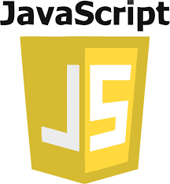

## Hi there 👋

Virology && Reverse Engineering && Programmer

- 🌱 I’m currently learning Programmer && Reverse Engineer
- 💬 Ask me anything about My Skills
- 🎈 I’m looking to collaborate on Reverse Engineering, The future is open source!
- 🤔 I’m looking for help with Programmer
- 📫 How to reach me: Jospak@proton.me

<h1 align="center"> My Skills </h1>

    
    
    
    
    
    
    
<!--     
     -->

 
 

    
<!--      -->

